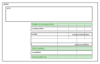

# PALEOocean Domains, fluxes, and standard Variables


###### Figure 1
*Ocean Domains, subDomains, and fluxes. Compare to full Earth system Domains <https://paleotoolkit.github.io/PALEOcopse.jl/dev/COPSE_Domains>*

## Domains

The standard Domain configuration for an atmosphere-ocean model is shown in Figure 1.
- **global** This is used for model-wide quantities, typically global budgets and global forcings

- **atmosphere** A scalar (0-D) Domain with atmospheric variables and Reactions

- **ocean** The `ocean` Domain represents a 3-D ocean as a vector of cells, with geometry and internal transport defined by an OceanTransport Reaction. 

- **oceansurface, oceanfloor** `oceansurface` and `oceanfloor` represent 2-D boundaries as a vector of cells, with geometry defined by the OceanTransport Reaction. There is a 1-to-1 correspondence between the cells in the 2-D `oceansurface` Domain, the adjacent `ocean` surface cells defined by the `ocean.oceansurface` subdomain. Similarly, there is a 1-to-1 correspondence between the cells in the 2-D `oceanfloor` Domain, the adjacent `ocean` floor cells defined by the `ocean.oceanfloor` subdomain.


## Fluxes
 Flux Domains are used to hold exchange fluxes in Variables defined by `FluxTarget` Reactions, see <https://paleotoolkit.github.io/PALEOboxes.jl/stable/DesignOverview/#Coupling-Spatial-Domains>

- **fluxAtmtoOceansurface** Air-sea exchange fluxes are defined in the 2-D `fluxAtmtoOceansurface` Domain, which contains cells with a 1-to-1 correspondence to the `oceansurface` Domain.

- **fluxOceanfloor** Particulate fluxes from ocean to oceanfloor, and solute exchange fluxes between ocean and oceanfloor, are defined in the 2-D `fluxOceanfloor` Domain. This contains cells with a 1-to-1 correspondence to cells in the `oceanfloor` Domain.

- **fluxOceanBurial** Ocean burial fluxes are defined in the 2-D `fluxOceanburial` Domain. This contains cells with a 1-to-1 correspondence to cells in the `oceanfloor` Domain.

## Standard Variables

(see [Skeleton ocean-atmosphere configuration](@ref))

    julia> include("PALEO_examples_oceanskeleton.jl")

```@setup oceanskeleton
include("../../examples/skeleton_configuration/PALEO_examples_oceanskeleton.jl") # hide
```
```@example oceanskeleton
show(PB.show_variables(model); allrows=true, allcols=true, eltypes=false, show_row_number=false)
```

ocean, oceansurface, and oceanfloor Variables are standard grid variables, provided by the ocean transport Reaction
(a `ReactionOceanTransport3box` in this case).

Flux target Variables to accumulate exchange fluxes are provided by `ReactionFluxTarget` Reactions, the illustrative
configuration here defines fluxes for a C, O, P model with atmospheric state variables CO2, O2, and ocean state
variables including DIC, TAlk, O2 and P.
