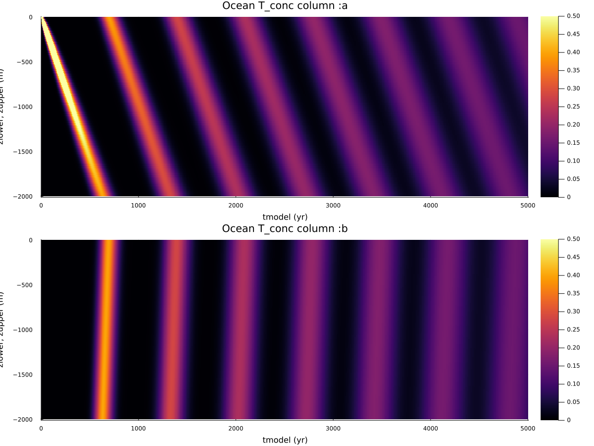
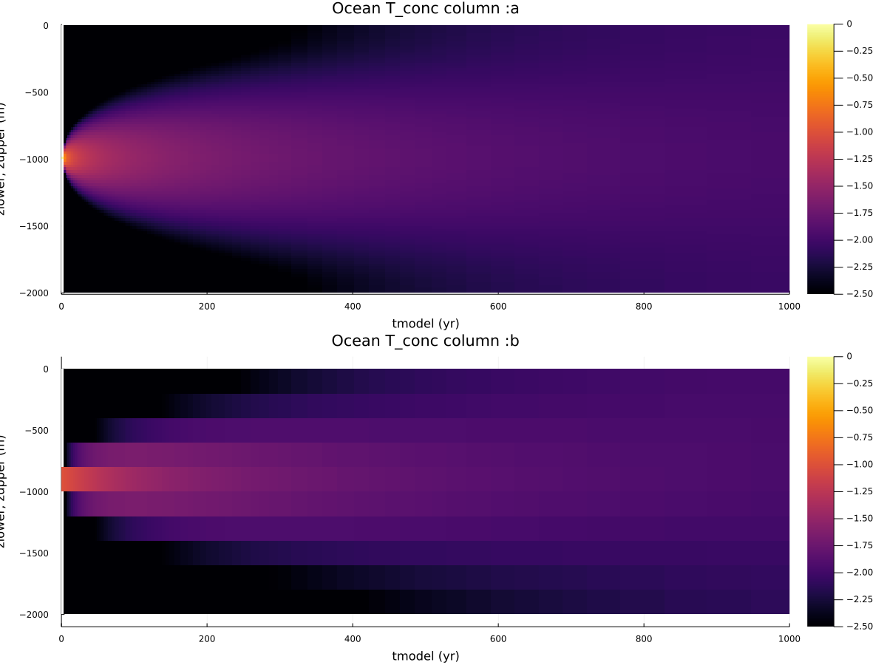

# Transport examples

`PALEOocean/examples/transport_examples` contains two examples showing the construction of (ocean) transport matrices,
using [`PALEOocean.Ocean.add_loop!`](@ref) to construct a transport matrix by adding circulation around closed loops.

## Advection

    julia> include("PALEO_examples_transport_advect.jl")

This uses [`TransportExamples.ReactionTransportAdvectExample`](@ref) defined in `TransportExamples.jl` to construct a transport matrix with a closed loop circulation down the first column and up the second column of a column-based model.


###### Figure 1
*Closed loop circulation down col :a and up column :b resulting in advection of a tracer T down column :a and up column b:.  Area of :a is 10x that of :b, hence the advection velocity in :b is 10x that in :a.  NB: advection using CVODE, an implicit stiff ODE integrator, is quite diffusive*

## Diffusion

    julia> include("PALEO_examples_transport_diffuse.jl")

This uses [`TransportExamples.ReactionTransportDiffuseExample`](@ref) defined in `TransportExamples.jl` to construct a transport matrix with constant vertical diffusivity `Kz`.


###### Figure 2
*Constant diffusivity `Kz` columns :a and :b.  Cell thickness in :b is 10x that of :a*

## Additional Reactions
```@meta
CurrentModule = TransportExamples
```
```@docs
ReactionTransportAdvectExample
ReactionTransportDiffuseExample
```