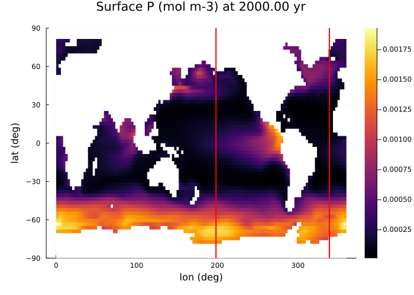

# MITgcm transport matrix ocean-only examples

GCM ocean transport test cases using transport matrices in format defined by [Khatiwala2007](@cite)

Examples require a download of Samar Khatiwala's TMM files (for MITgcm, UVic models) as described in https://github.com/samarkhatiwala/tmm where TM files are from http://kelvin.earth.ox.ac.uk/spk/Research/TMM/TransportMatrixConfigs/. The TMMDir key in `examples\LocalPreferences.toml` should then be set to the folder location on the local machine.

Default configurations are set to run for ~10 model yr, single core, single fixed timestep. See comments in .jl files to change run time and enable threading and split-timestep solver (with fast timestep for biogeochemistry and vertical transport).  

Approximate model CPU times below are for a single laptop core (a CPU i5-6300U from ~2015).

## 2.8 degree O2 only abiotic

Minimal test case for ocean transport and air-sea exchange.

Tracers: atmosphere O2, ocean O2

    julia> include("MITgcm_2deg8_abiotic.jl")

Wallclock time: 10.3 s core-1 (model yr)-1  with default timestep = 86400 s (1 day)

## 2.8 degree P, O2 

Minimal test case for biotic ocean.

Tracers: atmosphere O2, ocean O2, P, DOP

    julia> include("MITgcm_2deg8_PO4MMbase.jl")

Wallclock time: 10.0 s core-1 (model yr)-1  with default timestep = 86400 s (1 day)

## 2.8 degree P, O2, S, DIC/TAlk

Minimal test case for a biotic ocean with carbonate chemistry, SO4/H2S and CH4.

Modern Earth configuration with O2 set to 0.1 PAL with to provide an anoxic ocean test case.

Tracers: atmosphere O2, CO2(x2), ocean O2, P, DOC(x2), H2S(x2), SO4(x2), CH4(x2), DIC(x2), TAlk (13 ocean tracers, including d13C and d34S isotopes)

    julia> include("MITgcm_2deg8_PO4MMcarbSCH4.jl")

Wallclock time: 27.2 s core-1 (model yr)-1  with default timestep = 86400 s (1 day)

###### Figure 1
*Surface P concentration at 2000yr. Red lines indicate longitudinal sections*

 
###### Figure 2
*H2S concentration at 2000yr, sections at longitudes corresponding to red lines in Figure 1*

