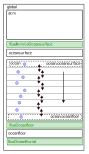

# 1D shelf sea examples and test cases

###### Figure 1
*1D shelf configuration Domains and processes. Blue dots: tracers. Red arrows: circulation transport represented as eddy diffusivivity Kz, implmented by [`PALEOocean.Ocean.OceanTransportColumn.ReactionOceanTransportColumn`](@ref). Black arrow: vertical transport, implemented by [`PALEOocean.Ocean.VerticalTransport.ReactionSinkFloat`](@ref)*

## Installation and configuration
These examples require netcdf files defining an annual cycle of physical variables: 
- water column eddy diffusivity Kz, temperature, density
- surface windspeed

The example configurations assume a zip file (available from <https://github.com/PALEOtoolkit/PALEOocean.jl/releases>)
with an illustrative 80m deep seasonally-stratifying shelf
(50N, Celtic sea) derived from the S2P3 model has been unpacked to subfolder `S2P3_transport_20240614`,  the script
`download_S2P3_files.jl` provides a function to do this:

    include("download_S2P3_files.jl")

    download_romaniello_S2P3_files()  # download and unzip

(this is collated output from the Windows 'Physics Biology Model' (s2p3.exe), http://pcwww.liv.ac.uk/~jons/model.htm
see 'Introduction to the Physical and Biological Oceanography of Shelf Seas', Simpson & Sharples (2012), CUP)

## 1D shelf examples

### O2 and passive tracer test case

    julia> include("PALEO_examples_shelf1D_O2_only.jl")

Test case demonstrating O2 air-sea exchange, and mixing of fast and slow sinking passive tracers.

### Minimal phytoplankton P, O2

    julia> include("PALEO_examples_shelf1D_P_O2.jl")

Minimal single-nutrient (parameterized as phosphorus) and light-limited phytoplankton population.

### Sulphur and carbonate system

    julia> include("PALEO_examples_shelf1D_P_O2_S_CH4_carb.jl")

Oxygenic and anoxygenic phytoplankton populations, with sulphur + methane and marine carbonate system.

## 1D shelf + sediment examples

### Minimal phytoplankton water-column sediment

    julia> include("PALEO_examples_shelf1Dsed.jl")

Coupled water-column - sediment configuration, with single phytoplankton population, sulphur + methane.

## Reading output with python xarray

`Test xarray netcdf.ipynb` demonstrates reading PALEO netcdf output using Python xarray.
